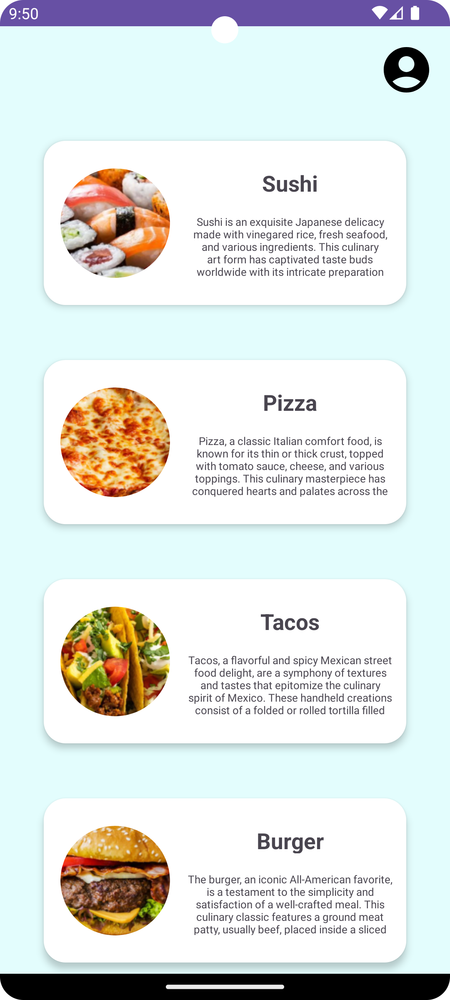
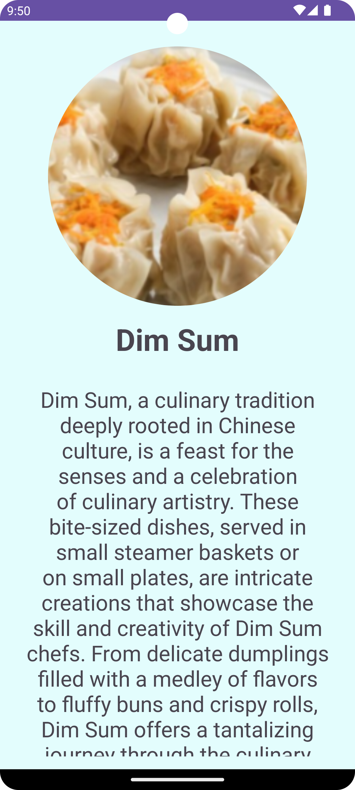

<div align="center">

# 🍕 FoodTastic

### Discover the World's Cuisines at Your Fingertips

[](https://www.codefactor.io/repository/github/danielwidhiarto/foodtastic)
[](https://www.android.com/)
[](https://kotlinlang.org/)
[](LICENSE)

[Features](#-features) • [Screenshots](#-screenshots) • [Installation](#-installation) • [Tech Stack](#-tech-stack) • [Contributing](#-contributing)

</div>

---

## 📖 About

**FoodTastic** is a modern Android application built with Kotlin that brings the world of diverse cuisines to your fingertips. Whether you're a food enthusiast, a home chef, or simply curious about global culinary traditions, FoodTastic offers an immersive experience to explore, learn, and share your passion for food.

## ✨ Features

### 🌍 Global Cuisine Catalogue

Explore an extensive collection of foods from different cultures around the world, featuring:

- **20+ International Dishes** including Sushi, Pizza, Tacos, Pho, Dim Sum, and more
- Beautiful high-quality food images
- Organized by cuisine type and region

### 📋 Detailed Food Profiles

Get comprehensive information about each dish:

- Ingredients and nutritional information
- Preparation methods and cooking techniques
- Cultural background and significance
- Origin stories and fun facts

### 👤 User Profile Management

Personalize your culinary journey:

- Create and customize your profile
- Track your favorite dishes
- Share your food experiences
- Build your personal food diary

### 🎨 Modern UI/UX

- Clean and intuitive Material Design interface
- Smooth animations and transitions
- Dark mode support
- Responsive layouts for all screen sizes

## 📱 Screenshots

<div align="center">

|                   Home Screen                    |                    Food Catalogue                     |                    Detail View                     |
| :----------------------------------------------: | :---------------------------------------------------: | :------------------------------------------------: |
|  |  |  |

|                    Profile View                     |                       Share Feature                        |                    Food Info                     |
| :-------------------------------------------------: | :--------------------------------------------------------: | :----------------------------------------------: |
|  |  |  |

</div>

## 🚀 Installation

### Prerequisites

- **Android Studio** Arctic Fox or newer
- **JDK** 11 or higher
- **Android SDK** API Level 24 (Android 7.0) or higher
- **Gradle** 8.0+

### Setup Instructions

1. **Clone the repository**

   ```bash
   git clone https://github.com/danielwidhiarto/FoodTastic.git
   cd FoodTastic
   ```

2. **Open in Android Studio**

   - Launch Android Studio
   - Select `File > Open`
   - Navigate to the cloned repository and click `OK`

3. **Sync Gradle**

   - Wait for Android Studio to sync Gradle files automatically
   - Or manually sync: `File > Sync Project with Gradle Files`

4. **Run the application**
   - Connect an Android device via USB with USB debugging enabled, or
   - Launch an Android emulator (API 24+)
   - Click the `Run` button (▶️) or press `Shift + F10`

### Quick Start

```bash
# Clone the repo
git clone https://github.com/danielwidhiarto/FoodTastic.git

# Navigate to project
cd FoodTastic

# Build the project
./gradlew build

# Install on connected device
./gradlew installDebug
```

## 🛠 Tech Stack

### Core Technologies

- **Language**: [Kotlin](https://kotlinlang.org/) 1.9.0
- **SDK**: Android API 24+ (Android 7.0+)
- **Build System**: Gradle 8.1.3 with Kotlin DSL
- **IDE**: Android Studio

### Android Components

- **UI Framework**: Android XML Layouts
- **Activity Management**: Modern Android Activities
- **Image Assets**: Mipmap & Drawable resources
- **Manifest**: Standard Android app configuration

### Architecture & Patterns

- **Pattern**: Model-View-Controller (MVC)
- **Navigation**: Intent-based navigation
- **Resource Management**: Android Resource system

### Development Tools

- **Version Control**: Git & GitHub
- **Code Quality**: CodeFactor integration
- **Build Automation**: Gradle Wrapper
- **Testing**: AndroidTest framework

## 📂 Project Structure

```
FoodTastic/
├── app/
│   ├── src/
│   │   ├── main/
│   │   │   ├── java/edu/bluejack23_1/
│   │   │   │   ├── MainActivity.kt
│   │   │   │   ├── ProductDetailActivity.kt
│   │   │   │   └── AboutProfileActivity.kt
│   │   │   ├── res/
│   │   │   │   ├── drawable/          # Food images & icons
│   │   │   │   ├── layout/            # XML layouts
│   │   │   │   ├── mipmap/            # App icons
│   │   │   │   └── values/            # Strings, colors, themes
│   │   │   └── AndroidManifest.xml
│   │   ├── androidTest/               # Instrumented tests
│   │   └── test/                      # Unit tests
│   └── build.gradle.kts
├── gradle/
├── snapshot/                          # App screenshots
├── build.gradle.kts
├── settings.gradle.kts
├── LICENSE
└── README.md
```

## 🎯 Usage

### Exploring Foods

1. Launch the app and browse the main catalogue
2. Scroll through various international cuisines
3. Tap on any food card to view more details

### Viewing Details

1. Select a food item from the catalogue
2. View comprehensive information including ingredients, origin, and cultural significance
3. Use the share button to share your favorite dishes with friends

### Managing Profile

1. Navigate to the profile section
2. Customize your user information
3. Track your favorite foods and culinary preferences

## 🤝 Contributing

We welcome contributions from the community! Here's how you can help:

### How to Contribute

1. **Fork the repository**

   ```bash
   # Click the 'Fork' button at the top right of this page
   ```

2. **Create a feature branch**

   ```bash
   git checkout -b feature/AmazingFeature
   ```

3. **Make your changes**

   - Write clean, readable code
   - Follow Kotlin coding conventions
   - Add comments where necessary
   - Update documentation if needed

4. **Commit your changes**

   ```bash
   git commit -m "Add some AmazingFeature"
   ```

5. **Push to your branch**

   ```bash
   git push origin feature/AmazingFeature
   ```

6. **Open a Pull Request**
   - Go to the original repository
   - Click `New Pull Request`
   - Provide a clear description of your changes

### Contribution Guidelines

- **Code Style**: Follow [Kotlin coding conventions](https://kotlinlang.org/docs/coding-conventions.html)
- **Commits**: Write clear, descriptive commit messages
- **Testing**: Add tests for new features
- **Documentation**: Update README and code comments
- **Issues**: Check existing issues before creating new ones

### Areas for Contribution

- 🐛 Bug fixes and improvements
- ✨ New features and enhancements
- 📝 Documentation improvements
- 🎨 UI/UX enhancements
- 🌍 Translations and localization
- 🧪 Testing and quality assurance

## 🐛 Bug Reports & Feature Requests

Found a bug or have a feature idea? We'd love to hear from you!

- **Bug Reports**: [Open an issue](https://github.com/danielwidhiarto/FoodTastic/issues/new?labels=bug)
- **Feature Requests**: [Open an issue](https://github.com/danielwidhiarto/FoodTastic/issues/new?labels=enhancement)
- **Questions**: [Start a discussion](https://github.com/danielwidhiarto/FoodTastic/discussions)

When reporting bugs, please include:

- Device model and Android version
- Steps to reproduce the issue
- Expected vs actual behavior
- Screenshots if applicable

## 📜 License

This project is licensed under the **MIT License** - see the [LICENSE](LICENSE) file for details.

```
MIT License

Copyright (c) 2023 FoodTastic Contributors

Permission is hereby granted, free of charge, to any person obtaining a copy
of this software and associated documentation files (the "Software"), to deal
in the Software without restriction...
```

## 👨‍💻 Authors & Contributors

- **Daniel Widhiarto** - _Initial work_ - [@danielwidhiarto](https://github.com/danielwidhiarto)

See also the list of [contributors](https://github.com/danielwidhiarto/FoodTastic/contributors) who participated in this project.

## 🙏 Acknowledgments

- Thanks to all contributors who have helped shape FoodTastic
- Food images and cultural information from various culinary sources
- Android community for excellent documentation and support
- CodeFactor for code quality analysis

## 📞 Contact & Support

- **GitHub Issues**: [Report bugs or request features](https://github.com/danielwidhiarto/FoodTastic/issues)
- **Email**: [Create an issue for contact](https://github.com/danielwidhiarto/FoodTastic/issues)
- **Documentation**: Check our [Wiki](https://github.com/danielwidhiarto/FoodTastic/wiki) for more information

---

<div align="center">

**⭐ Star this repository if you find it helpful!**

Made with ❤️ and Kotlin

[Back to Top](#-foodtastic)

</div>
